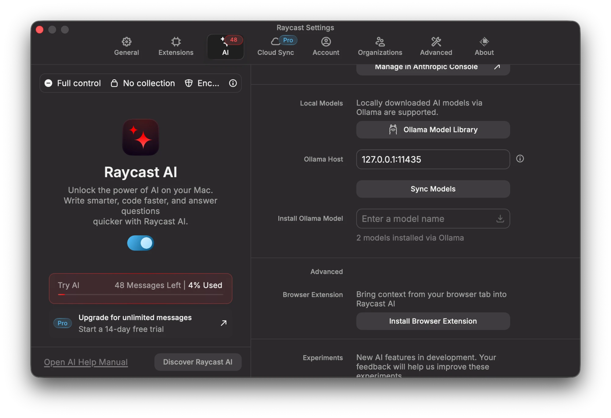
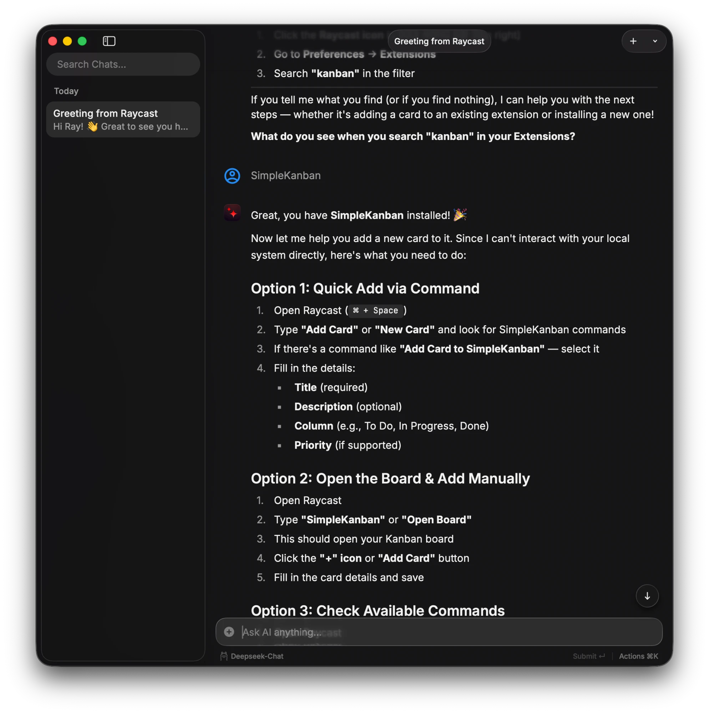

# DeepSeek AI provider for Raycast

Use DeepSeek (`deepseek-chat` / `deepseek-reasoner`) as a native AI model
inside Raycast — no Ollama installation required. A lightweight Go server
speaks the Ollama REST API and proxies every request to the DeepSeek cloud
API, so Raycast's built-in **Local Models** integration works out of the box.

Go port of [RobToMars/DeepSeek `fake_ollama_server.py`](https://github.com/RobToMars/DeepSeek/blob/main/fake_ollama_server.py),
with fixes: `deepseek-reasoner`'s reasoning streams as Ollama's native
`message.thinking`, sampling options pass through, NDJSON uses the correct
media type, and upstream errors keep their real status codes.

## Installation

### From package (recommended)

Requires Go 1.22+:

```sh
go install github.com/namtx/mydeepseek@latest
```

This installs a `mydeepseek` binary to `$GOPATH/bin` (usually `~/go/bin`).
Make sure that directory is on your `$PATH`.

### Build from source

```sh
git clone https://github.com/namtx/mydeepseek.git
cd mydeepseek
make build        # produces ./fake-ollama
```

Or without Make:

```sh
go build -o fake-ollama .
```

## Setup: add DeepSeek as a Raycast AI provider

1. **Get a DeepSeek API key** from [platform.deepseek.com](https://platform.deepseek.com) if you don't have one.

2. **Start the server** with that key:

   ```sh
   export DEEPSEEK_API_KEY=sk-...
   mydeepseek          # if installed via go install
   # or
   ./fake-ollama       # if built from source
   ```

   You should see `fake ollama server listening on 127.0.0.1:11435 (upstream https://api.deepseek.com)`.
   Leave this running — Raycast talks to it for every request.

3. **Open Raycast → Settings → AI → Local Models.**

4. **Set the Ollama Host field to `127.0.0.1:11435`.**

   > **Do not enter `127.0.0.1:11434`.** Raycast's built-in Local Models
   > feature treats that exact address as "use the real Ollama app I manage
   > myself" and never even queries it — it looks for the actual Ollama.app
   > by bundle identifier and reports "Ollama app is not installed" if
   > that's missing, regardless of anything already listening on the port.
   > Any other host value (this server's default, `127.0.0.1:11435`) makes
   > Raycast treat it as a custom server and talk plain HTTP to it — the
   > only path this facade can serve. Details in
   > [docs/adr/0003](docs/adr/0003-listen-on-a-nondefault-port.md).

   

5. **Sync or add the models.** Raycast should pick up the model list from
   `/api/tags` automatically. If it doesn't show up, use "Add a Model via
   Ollama" and type the name exactly — no `:latest` or size suffix:
   - `deepseek-chat`
   - `deepseek-reasoner` (shows its reasoning as a "thinking" section)

6. **Pick the model in a Raycast AI command** (Quick AI, AI Chat, etc.) —
   select `deepseek-chat` or `deepseek-reasoner` from the model picker like
   any other local model.

   

7. **Verify it works**: ask it something in Quick AI. If you get an error
   instead of a reply, check the server's terminal output — upstream errors
   from DeepSeek (bad key, rate limit) are logged there with their real
   status code.

### Configuration

| Env var            | Default                    | Meaning                          |
|--------------------|----------------------------|----------------------------------|
| `DEEPSEEK_API_KEY` | *(required)*               | DeepSeek API key                 |
| `DEEPSEEK_BASE_URL`| `https://api.deepseek.com` | Upstream base URL                |
| `OLLAMA_HOST`      | `127.0.0.1:11435`          | Listen address (`host:port`)     |

## Endpoints

| Endpoint           | Behavior                                                        |
|--------------------|-----------------------------------------------------------------|
| `GET /`            | `Ollama is running`                                             |
| `GET /api/version` | Fake Ollama version                                             |
| `GET /api/tags`    | Fixed listing: `deepseek-chat`, `deepseek-reasoner`             |
| `POST /api/show`   | Fake metadata + capabilities (`thinking` for the reasoner)      |
| `POST /api/chat`   | Proxied to DeepSeek `/chat/completions`, streaming or not       |

Tool calling and `/api/generate` are deliberately out of scope — see
[docs/adr/0001](docs/adr/0001-raycast-local-models-is-the-compatibility-target.md).
Domain vocabulary lives in [CONTEXT.md](CONTEXT.md).

## Development

```sh
go test ./...   # no API key needed; upstream is faked with httptest
go build .
```
